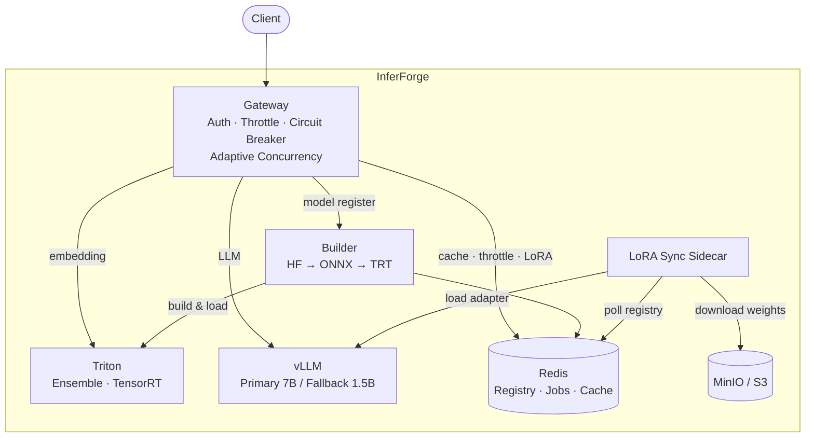

# InferForge

End-to-end ML inference platform — automated model building, high-performance serving, and LLM integration on a single self-hosted stack.

## TL;DR

- **Automated build pipeline** that converts HuggingFace models to TensorRT engines and deploys to Triton — one API call
- **Dual inference backends**: TensorRT ensembles for embeddings, vLLM for LLM generation with SSE streaming
- **Traffic resilience**: sliding window rate limiting, adaptive concurrency control, circuit breaker with graceful degradation (7B → 1.5B fallback)
- **Multi-LoRA**: pull-based adapter sync across GPU pods — Redis registry + MinIO storage + sidecar polling
## Why This Exists

Deploying ML models in production involves stitching together disparate systems — model conversion, serving infrastructure, traffic management, adapter lifecycle. Each piece is well-solved individually, but integrating them into a coherent platform requires careful design.

InferForge unifies this into a single stack:

```
POST /build {"model_type": "bert"}
  → HuggingFace download → ONNX export → TensorRT compile
  → Ensemble config generation (DAG-validated)
  → Triton deployment (auto-load)
  → Ready for inference
```

The core idea: **model onboarding is a pipeline, not a manual process**. Define a preset, and the system handles everything from weights to serving.

## Architecture



## Core Components

| Component | Role | Key Detail |
|---|---|---|
| Gateway | API entry point, traffic management | FastAPI with auth, adaptive concurrency, circuit breaker |
| Triton | Embedding/vision inference | Ensemble pipelines: preprocessor → TensorRT engine → postprocessor |
| vLLM | LLM text generation | SSE streaming, primary/fallback with graceful degradation |
| Builder | Model build automation | HF → ONNX → TRT → config.pbtxt → Triton deploy |
| LoRA Sync | Adapter lifecycle across pods | Pull-based: poll Redis → download from MinIO → load into vLLM |

## Build Pipeline

The Builder automates the full path from HuggingFace to production serving:

```
POST /build {"model_type": "bert"}

PENDING → BUILDING_ONNX → BUILDING_TRT → GENERATING_CONFIG → DEPLOYING → READY

1. Download from HuggingFace
2. Export to ONNX (dynamic axes, shape inference)
3. Compile to TensorRT (trtexec, fp16/int8, dynamic shapes)
4. Generate config.pbtxt (engine + processor + ensemble)
5. DAG validation (verify tensor connectivity across steps)
6. Deploy to Triton (load each submodel + ensemble)
```

**Ensemble example — BERT:**
```
TEXTS → bert_preprocessor (tokenizer, python_backend)
      → bert_engine (TensorRT, fp16)
      → bert_emb (pooled_output)
```

Build status is tracked via Redis with TTL expiration. Query with `GET /build/{job_id}`.

## Traffic Resilience

### Sliding Window Rate Limiting

Redis sorted set per client IP × endpoint. Unlike fixed-window counters, prevents burst at window boundaries.

| Endpoint | Limit | Window |
|---|---|---|
| `/infer` | 120 req | 60s |
| `/generate` | 60 req | 60s |

Response headers: `X-RateLimit-Limit`, `X-RateLimit-Remaining`, `Retry-After`

### Adaptive Concurrency Control

Static semaphores can't adapt to GPU load. The adaptive limiter measures response latency and adjusts:

```
latency < target × 0.7 → increase limit (+2)
latency > target        → decrease limit (×0.75)
```

Separate limiters for primary and fallback models. When primary is saturated, excess requests route to fallback automatically.

### Graceful Degradation

```
Request → Primary (7B) available?
            ├─ YES → process
            │         └─ failure → fallback
            └─ NO  → Fallback (1.5B) available?
                       ├─ YES → degraded response
                       └─ NO  → 503 "all models at capacity"
```

Circuit breaker detects sustained failures and short-circuits directly to fallback.

## Multi-LoRA Adapter Management

Pull-based sync pattern — same architecture used in large-scale production (100+ pods):

```
1. Register:  POST /lora/register → Redis metadata store
2. Upload:    Adapter weights → MinIO (S3-compatible)
3. Sync:      Each pod's sidecar polls Redis every 30s
                → detects new/updated adapter
                → downloads from MinIO
                → calls vLLM load_lora_adapter
4. Remove:    DELETE /lora/{name} → Redis
                → next poll cycle → pods unload adapter
```

| API | Action |
|---|---|
| `POST /lora/register` | Register adapter (auto-increments version) |
| `DELETE /lora/{name}` | Remove adapter (pods unload on next poll) |
| `GET /lora` | List all registered adapters |
| `GET /lora/{name}` | Get adapter details |

Use in inference: `POST /generate {"lora_adapter": "ko-chat", ...}`

## Project Structure

```
inferforge/
├── gateway/                 # API Gateway (FastAPI)
│   ├── routers/             # inference, generate, models, lora, health
│   ├── services/            # inference_service, generation_service, lora_registry
│   ├── middlewares/         # throttle, circuit_breaker, adaptive_concurrency
│   ├── clients/             # triton, vllm, redis, builder HTTP clients
│   └── schemas/             # request/response models
├── builder/                 # Build Pipeline Service
│   ├── services/            # build_pipeline, config_generator, dag_validator, onnx_exporter
│   ├── processors/          # Triton python_backend processors (bert/, clip/)
│   └── presets/             # Model preset definitions (YAML)
├── lora_sync/               # LoRA sync sidecar
├── docker/                  # Dockerfiles + docker-compose
├── model_repository/        # Triton model repository
├── example/                 # Usage examples
└── tests/
    ├── unit/                # Unit tests (80+)
    └── integration/         # Integration tests (Docker-based)
```

## Getting Started

```bash
# Clone and setup
git clone https://github.com/thjung123/inferforge.git
cd inferforge
uv sync

# Start all services
docker-compose -f docker/docker-compose.yml up --build

# Register and build a model
curl -X POST http://localhost:8080/models/register \
  -H "x-api-key: test-key" -H "Content-Type: application/json" \
  -d '{"model_type": "bert"}'

# Embedding inference
curl -X POST http://localhost:8080/infer \
  -H "x-api-key: test-key" -H "Content-Type: application/json" \
  -d '{"model_name": "bert_ensemble", "inputs": {"texts": ["Hello world"]}}'

# LLM generation
curl -X POST http://localhost:8080/generate \
  -H "x-api-key: test-key" -H "Content-Type: application/json" \
  -d '{"messages": [{"role": "user", "content": "Explain TensorRT."}], "max_tokens": 128}'
```

## Testing

```bash
uv run pytest -v tests/unit          # Unit tests
uv run pytest -v tests/integration   # Integration tests (requires Docker)
```

## Tech Stack

| Layer | Technology |
|---|---|
| API Gateway | FastAPI, Gunicorn |
| Embedding Inference | NVIDIA Triton, TensorRT |
| LLM Inference | vLLM |
| Model Building | ONNX, TensorRT (trtexec) |
| Adapter Storage | MinIO (S3-compatible) |
| State/Cache | Redis |
| Containerization | Docker, Docker Compose |
| Testing | pytest, httpx, Testcontainers |

## Production Notes

- **LoRA adapter registry** uses Redis + MinIO here. In production, replace with a persistent model registry (e.g. MLflow, Vertex AI) and S3/GCS for adapter storage.
- **Adapter sync** uses a pull-based pattern — each vLLM pod polls the registry and downloads from object storage. Same pattern used at scale in production systems.
- **Adaptive concurrency** dynamically adjusts GPU concurrency limits based on response latency, preventing saturation under variable load.
