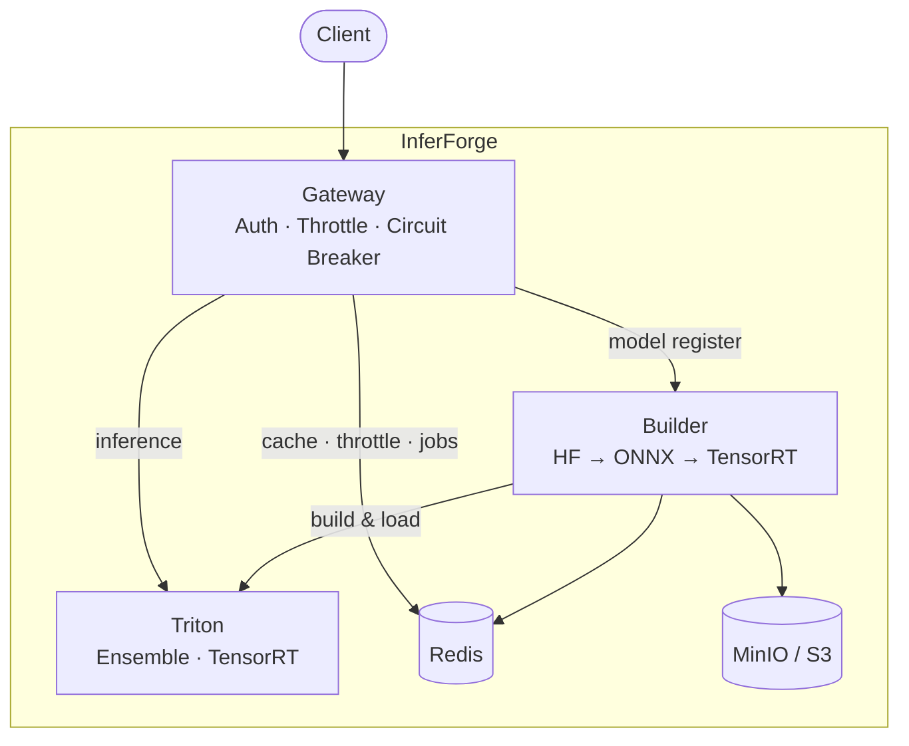

# InferForge

A self-hosted inference stack for embedding and vision models. InferForge builds
Hugging Face models into TensorRT engines served by NVIDIA Triton and fronts them
with a FastAPI gateway for authentication, rate limiting, caching, model
management, and circuit breaking.

## Architecture


```mermaid
graph TB
    Client([Client]) --> Gateway

    subgraph InferForge
        Gateway[Gateway<br/>Auth · Throttle · Circuit Breaker]
        Gateway -->|inference| Triton[Triton<br/>Ensemble · TensorRT]
        Gateway -->|model register| Builder
        Gateway -->|cache · throttle · jobs| Redis[(Redis)]
        Builder[Builder<br/>HF → ONNX → TensorRT] -->|build & load| Triton
        Builder --> Redis
        Builder --> MinIO[(MinIO / S3)]
    end
```

## Components

| Component | Role |
|---|---|
| Gateway | FastAPI entry point: auth, throttling, circuit breaking, inference, and model APIs |
| Triton | Embedding and vision inference through TensorRT ensembles |
| Builder | Hugging Face → ONNX → TensorRT → Triton deployment |
| Redis | Build jobs, model usage, embedding cache, and rate-limit state |
| MinIO | Object storage for built model artifacts |

## Build pipeline

One request takes a model from Hugging Face to a served Triton ensemble:

```text
POST /models/register {"model_type": "bert"}

PENDING → BUILDING_ONNX → BUILDING_TRT → GENERATING_CONFIG → DEPLOYING → VALIDATING_PRECISION → READY
```

1. Download the model from Hugging Face.
2. Export it to ONNX with dynamic axes.
3. Compile it to TensorRT with `trtexec`.
4. Generate the processor, engine, and ensemble `config.pbtxt` files.
5. Validate tensor connectivity and output ports.
6. Deploy and load the model in Triton.
7. Compare fp16 engine output with the fp32 ONNX reference.

BERT ensemble:

```text
TEXTS → bert_preprocessor
      → bert_encoder (TensorRT fp16)
      → bert_postprocessor (masked mean pooling)
      → bert_emb
```

Build status is tracked in Redis with a TTL. Query it with
`GET /models/jobs/{job_id}`.

## Traffic resilience

`/infer` uses a Redis-backed sliding-window rate limit of 120 requests per 60
seconds for each client IP. Responses include `X-RateLimit-*` and `Retry-After`
headers. A local semaphore bounds concurrent inference, while the Triton circuit
breaker stops routing during sustained failures.

## Embedding model tiering

When `ENABLE_TIERING` is enabled, `/infer` records model usage and a background
reaper demotes idle models:

| Tier | State | Trigger |
|---|---|---|
| hot | on GPU | high request rate |
| warm | loaded | moderate or recent use |
| cold | unloaded from Triton | idle |
| archive | unloaded, artifact retained in object storage | long idle period |

## Layout

```text
gateway/           FastAPI gateway, clients, middleware, schemas, and services
builder/           Build pipeline, BERT/CLIP processors, and presets
common/            Shared structured logging
model_repository/  Triton model repository
docker/            Container definitions and Compose configuration
example/           Inference examples
tests/             Unit and integration tests
```

## Running

```bash
git clone https://github.com/thjung123/inferforge.git
cd inferforge
uv sync

docker compose -f docker/docker-compose.yml up --build

curl -X POST http://localhost:8080/models/register \
  -H "x-api-key: test-key" -H "Content-Type: application/json" \
  -d '{"model_type": "bert"}'

curl -X POST http://localhost:8080/infer \
  -H "x-api-key: test-key" -H "Content-Type: application/json" \
  -d '{"model_name": "bert_ensemble", "inputs": {"texts": ["Hello world"]}}'
```

## Testing

```bash
uv run pytest tests/unit
uv run pytest tests/integration  # requires Docker
```

## Stack

FastAPI, Uvicorn, NVIDIA Triton, TensorRT, ONNX, Redis, MinIO, and Docker.

## Notes

- BERT is the fully validated embedding path. CLIP uses the same build pipeline
  for image/text similarity but has received less end-to-end validation.
- `/infer` dispatches to a manager for each preset, so a new model type needs a
  manager as well as a build preset.
- JWT validation is enabled only when `JWT_SECRET` is set; API-key auth remains
  available independently.
- Circuit breakers and the inference semaphore are process-local and currently
  assume a single Uvicorn worker. Rate limiting is already shared through Redis.
