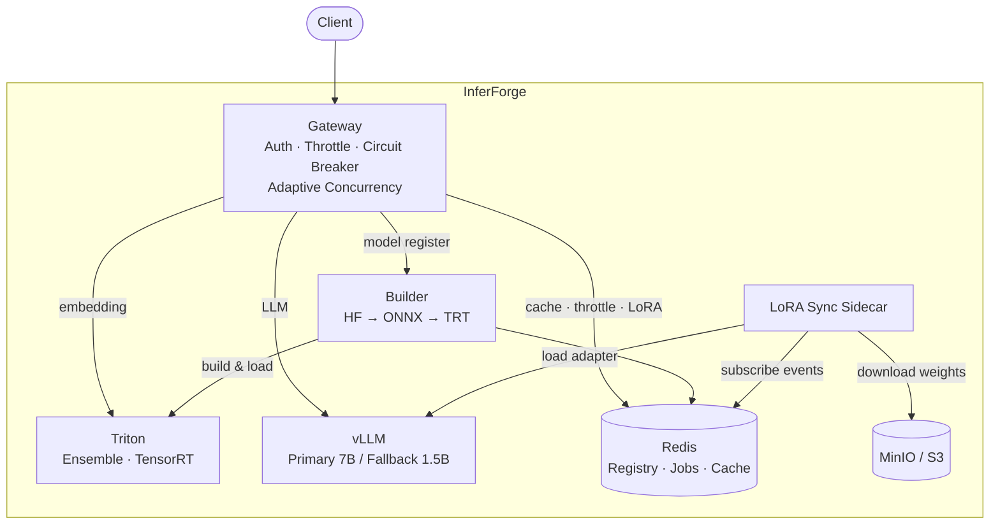

# InferForge

A self-hosted inference stack for embedding and generative models. It builds
HuggingFace models into TensorRT engines served on Triton, fronts them with a
FastAPI gateway (auth, rate limiting, adaptive concurrency, circuit breaker), and
runs vLLM for text generation with a 7B → 1.5B fallback.

It started as a way to work through the whole path — model conversion, serving,
traffic control, adapter lifecycle — as one system instead of separate pieces.

## Architecture


```mermaid
graph TB
    Client([Client]) --> Gateway

    subgraph InferForge
        Gateway[Gateway<br/>Auth · Throttle · Circuit Breaker<br/>Adaptive Concurrency]

        Gateway -->|embedding| Triton[Triton<br/>Ensemble · TensorRT]
        Gateway -->|LLM| vLLM[vLLM<br/>Primary 7B / Fallback 1.5B]
        Gateway -->|model register| Builder
        Gateway -->|cache · throttle · LoRA| Redis

        Builder[Builder<br/>HF → ONNX → TRT] -->|build & load| Triton
        Builder --> Redis[(Redis<br/>Registry · Jobs · Cache)]

        LoRASync[LoRA Sync Sidecar] -->|subscribe events| Redis
        LoRASync -->|download weights| MinIO[(MinIO / S3)]
        LoRASync -->|load adapter| vLLM
    end
```

## Components

| Component | Role |
|---|---|
| Gateway | FastAPI entry point: auth, throttling, circuit breaker, adaptive concurrency |
| Triton | Embedding/vision inference via TensorRT ensembles |
| vLLM | Text generation, SSE streaming, primary/fallback |
| Builder | HF → ONNX → TensorRT → config.pbtxt → Triton deploy |
| LoRA Sync | Per-pod sidecar: subscribes to Redis, pulls adapters from MinIO, loads into vLLM |

## Build pipeline

One request takes a model from HuggingFace to a served Triton ensemble:

```
POST /models/register {"model_type": "bert"}

PENDING → BUILDING_ONNX → BUILDING_TRT → GENERATING_CONFIG → DEPLOYING → VALIDATING_PRECISION → READY
```

1. Download from HuggingFace
2. Export to ONNX (dynamic axes)
3. Compile to TensorRT (trtexec, fp16)
4. Generate config.pbtxt (engine + processors + ensemble)
5. DAG validation (tensor connectivity + output ports)
6. Deploy to Triton
7. Precision check: fp16 engine vs fp32 ONNX reference, gated on cosine / max-abs-err

BERT ensemble:

```
TEXTS → bert_preprocessor (tokenizer)
      → bert_encoder (TensorRT fp16 → last_hidden_state)
      → bert_postprocessor (masked mean pooling)
      → bert_emb
```

Build status is tracked in Redis with a TTL; query `GET /models/jobs/{job_id}`.

## Traffic resilience

### Rate limiting

Sliding window per client IP × endpoint (Redis sorted set), so a burst can't
straddle a window boundary. `/infer` 120/60s, `/generate` 60/60s. Responses carry
`X-RateLimit-*` and `Retry-After`.

### Adaptive concurrency

A static semaphore can't track GPU load, so the limit moves with measured latency:

```
latency < target × 0.7 → limit += 2
latency > target        → limit ×= 0.75
```

Primary and fallback have separate limiters; when primary saturates, requests spill
to fallback.

### Graceful degradation

```
primary (7B) available? → yes: process (fallback on failure)
                          no:  fallback (1.5B) available? → yes: degraded / no: 503
```

The circuit breaker trips on sustained failure and routes to fallback.

## Multi-LoRA

Each vLLM pod syncs its own adapters, pull-based:

```
register  POST /lora/register → Redis + publish event
upload    adapter weights → MinIO
sync      pod sidecar subscribes to the event → downloads from MinIO → vLLM load_lora_adapter
          (a periodic reconcile covers missed events)
remove    DELETE /lora/{name} → Redis + publish → pods unload
```

| API | |
|---|---|
| `POST /lora/register` | register (version auto-increments) |
| `DELETE /lora/{name}` | remove |
| `GET /lora`, `GET /lora/{name}` | list, detail |

Use with `POST /generate {"lora_adapter": "ko-chat", ...}`.

## Embedding model tiering

Keeping every built model hot on the GPU wastes memory, so `/infer` records usage
in Redis and a background reaper demotes idle models:

| Tier | State | Trigger |
|---|---|---|
| hot | on GPU | request rate ≥ threshold |
| warm | loaded | moderate / recent use |
| cold | unloaded from Triton | idle |
| archive | unloaded, engine kept in the S3 repo | long idle |

`decide_tier` is a pure function of rate and idle time; the load/unload/archive
effects are injected, so the policy is tested without Triton or object storage.
Gated behind `ENABLE_TIERING`. Archive currently just unloads (the engine stays in
the S3 repo); the cold-bucket move and `warm` scale-down are TODO.

## Layout

```
gateway/       # FastAPI gateway: routers, services, middlewares, clients, schemas
builder/       # build pipeline: services, processors (bert/, clip/), presets
lora_sync/     # LoRA sync sidecar
common/        # JSON logger shared by the Triton model_repository backends (no gateway dependency)
model_repository/  # Triton model repository
docker/        # Dockerfiles + compose
example/       # usage examples
tests/         # unit + integration
```

## Running

```bash
git clone https://github.com/thjung123/inferforge.git
cd inferforge
uv sync

docker compose -f docker/docker-compose.yml up --build

# build a model
curl -X POST http://localhost:8080/models/register \
  -H "x-api-key: test-key" -H "Content-Type: application/json" \
  -d '{"model_type": "bert"}'

# embedding
curl -X POST http://localhost:8080/infer \
  -H "x-api-key: test-key" -H "Content-Type: application/json" \
  -d '{"model_name": "bert_ensemble", "inputs": {"texts": ["Hello world"]}}'

# generation
curl -X POST http://localhost:8080/generate \
  -H "x-api-key: test-key" -H "Content-Type: application/json" \
  -d '{"messages": [{"role": "user", "content": "Explain TensorRT."}], "max_tokens": 128}'
```

## Testing

```bash
uv run pytest tests/unit
uv run pytest tests/integration   # needs Docker
```

## Stack

FastAPI / Gunicorn, NVIDIA Triton + TensorRT, vLLM, ONNX, Redis, MinIO, Docker.

## Operations

**Health** — `/health` is liveness; `/health/ready` returns 503 when Redis is
unreachable so an orchestrator stops routing to a pod that can't serve. The
fault-injection hooks (`/health/fail`, `/unstable`, `/reset`) are gated behind
`ENABLE_FAULT_INJECTION` and 404 in prod.

**Deploy/rollback** — services are stateless behind the gateway; roll back by
redeploying the previous image. Served models live in the Triton repository (and
MinIO for archived engines), so a gateway rollback doesn't touch them.

**GPU sizing** — vLLM primary (7B fp16) ≈ 14 GB + KV cache, fallback (1.5B) ≈ 3 GB,
which fit a single 24 GB card. Triton embedding engines are small (bert-base fp16
≈ 220 MB); idle ones are demoted off the GPU by the tiering reaper.

**Alerting** — gateway 5xx rate, `/infer` and `/generate` p99 latency, circuit
breaker open state, adaptive-concurrency limit collapse, and build-job failures
(including precision-validation rejections). Metrics are Prometheus
(`http_requests_total`, `http_request_duration_seconds`), exposed at `/metrics` and
labeled by route template.

**Failure recovery** — vLLM primary failure degrades to the fallback; Triton
failures trip the circuit breaker (503 + `Retry-After`); a Redis outage fails the
throttle open, so requests still serve while rate limiting is paused.

## Notes and limitations

- Both BERT (text → embedding) and CLIP (image + text → similarity) build from a
  preset the same way — `register` compiles the towers, generates the ensemble
  config, and deploys it. BERT is the path with a full fp16 precision run behind it;
  CLIP shares the pipeline but has had less end-to-end validation.
- `/infer` dispatch routes to per-preset managers (BERT, CLIP); a new model type
  needs a manager, not just a build.
- Auth accepts an `x-api-key` or a JWT; JWT verification runs only when `JWT_SECRET`
  is set (an empty secret disables JWT while leaving API-key auth active), and JWTs
  must carry an `exp`.
- The adaptive limiters, circuit breakers, and `/infer` semaphore are in-process
  and assume a single Gunicorn worker; a multi-worker/multi-pod setup would move
  this state to Redis (rate limiting already lives there).
- The LoRA registry uses Redis + MinIO. In production you'd back it with a
  persistent registry (MLflow, Vertex AI) and S3/GCS.
- SSE streaming (`/generate` with `stream: true`) skips the adaptive limiter and
  the per-request failure fallback (no primary → fallback retry on error), though an
  open vLLM circuit breaker still routes it to the fallback. The non-streaming path
  has the full 7B → 1.5B degradation, including the on-failure retry.
