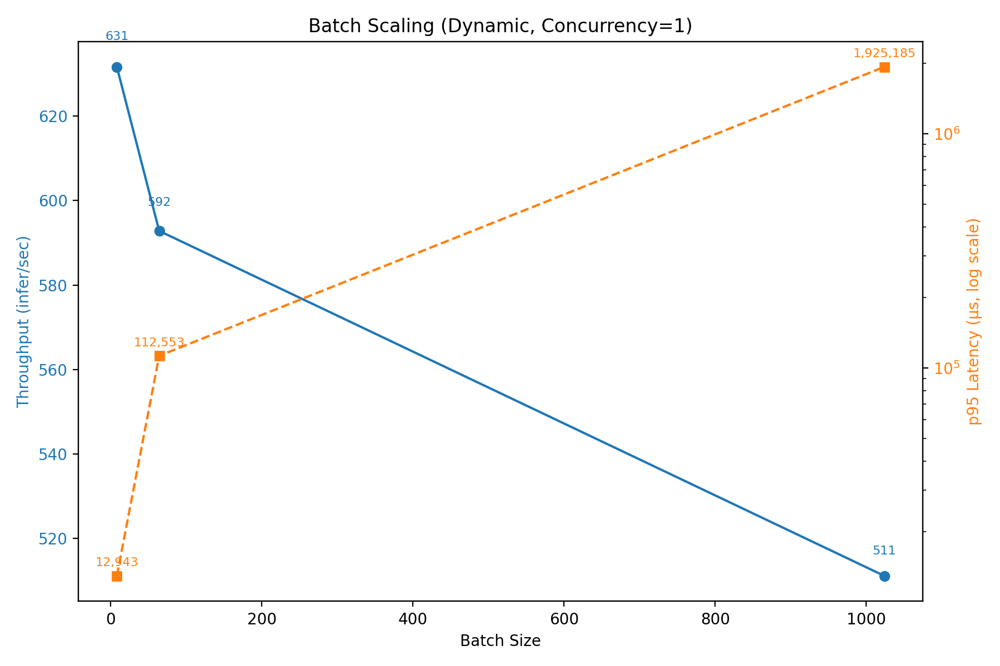
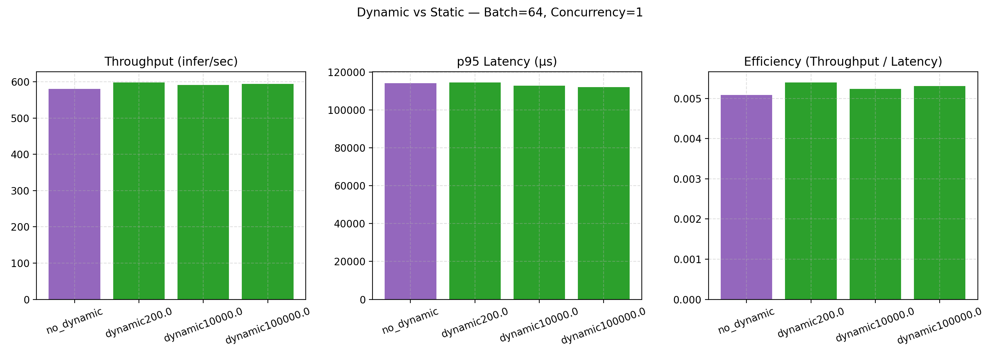
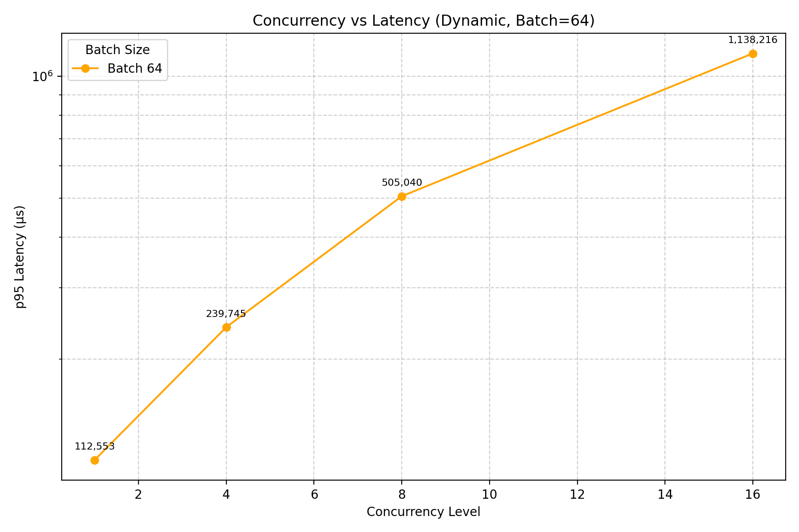
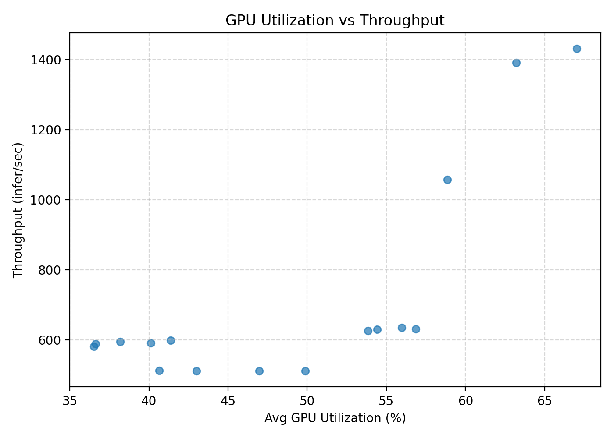

# CLIP Image Encoder Triton Performance Benchmark (T4 GPU)

## 1. Overview

This document summarizes the performance of the **CLIP (ViT-B/32) Image Encoder** served on **NVIDIA Triton Inference Server**,  
evaluated under different **batch sizes**, **concurrency levels**, and **dynamic batching configurations**.

| Metric                     | Description                                 |
| -------------------------- | ------------------------------------------- |
| **Throughput (infer/sec)** | Number of inferences processed per second   |
| **p95 Latency (µs)**       | 95th percentile latency across all requests |
| **GPU Utilization (%)**    | Average GPU usage reported by perf_analyzer |

---

## 2. Experiment Settings

| Parameter                    | Value                               |
| ----------------------------- | ----------------------------------- |
| **Model**                     | CLIP (ViT-B/32) – Image Encoder     |
| **Backend**                   | TensorRT (FP16)                     |
| **Server**                    | Triton Inference Server 24.07       |
| **GPU**                       | NVIDIA T4 (16 GB)                   |
| **Client Tool**               | `perf_analyzer`                     |
| **Batch sizes tested**        | 8, 64, 256, 512, 1024, 2048, 4096   |
| **Concurrency levels**        | 1, 4, 8, 16                         |
| **Dynamic batching configs**  | 200 / 10000 / 100000 µs delays, and disabled |
| **Max Batch Size**            | 4096                                |

TensorRT engine was built with the following optimization profiles:

```
--minShapes=image:1x3x224x224 \
--optShapes=image:1024x3x224x224 \
--maxShapes=image:4096x3x224x224
```

---

## 3. Results Summary

| Batch | Mode | Delay (µs) | Throughput (infer/sec) | p95 Latency (µs) | GPU Util (%) | Status | Notes |
|-------|------|-------------|-----------------------:|-----------------:|--------------:|--------|-------|
| 8     | dynamic | 200–100k | 629–634 | 12,834–13,057 | 54–57 | ✅ Pass | Stable baseline latency |
| 8     | no_dynamic | — | 625 | 13,103 | 53.8 | ✅ Pass | Slightly slower |
| 64    | dynamic | 200–100k | 587–594 | 112,000–114,500 | 36–41 | ✅ Pass | Stable, GPU underutilized |
| 64    | no_dynamic | — | 580 | 114,187 | 36.5 | ✅ Pass | Similar to dynamic |
| 1024  | dynamic | 200–100k | 511 | 1,913,000–1,943,000 | 40–49 | ✅ Pass | High latency, within optShape |
| 1024  | no_dynamic | — | 511 | 1,915,000 | 47.0 | ✅ Pass | Comparable to dynamic |
| 256, 512 | — | — | — | — | — | ❌ Fail | TensorRT workspace reallocation OOM (optShape=1024) |
| 2048, 4096 | — | — | — | — | — | ❌ Fail | True CUDA OOM (16GB limit) |

**Interpretation:**

- Only **batch sizes 8, 64, and 1024** successfully executed.  
- **256 and 512** failed due to internal TensorRT reallocation near the `optShape` boundary (not actual memory exhaustion).  
- **2048 and 4096** failed with true CUDA out-of-memory errors.  
- Throughput differences across dynamic delays (200 → 100000 µs) were negligible (<1%).  
- **Dynamic batching** produced minimal improvement due to small model size and short inference latency.

---

## 4. Visualization

Below are the core visualizations generated from the measured CSV results.

### 4.1 Batch Scaling (Dynamic, Concurrency=1)



- Throughput slightly decreases as batch size increases (631 → 511).  
- p95 latency grows exponentially: 13K → 1.9M µs (~150× increase).  
- GPU utilization decreases with larger batches, indicating memory and kernel scheduling bottlenecks.

---

### 4.2 Dynamic vs Static (Batch=64, Concurrency=1)



- Dynamic batching yielded a slight throughput improvement (≈ +1%) compared to static execution.
- p95 latency stayed within a ±2 % margin across all dynamic delay settings.
- Overall efficiency (throughput / latency) was nearly identical between modes, with dynamic showing marginal advantage and no noticeable batching overhead.

---

### 4.3 Concurrency vs Latency (Dynamic, Batch=64)



- p95 latency rises sharply as concurrency increases:  
  - 1 → 110K µs  
  - 4 → 239K µs  
  - 8 → 505K µs  
  - 16 → 1.13M µs  
- Beyond concurrency 4, GPU is saturated and latency scales superlinearly.

---

### 4.4 GPU Utilization vs Throughput



- GPU utilization roughly tracks throughput at small batches.  
- Utilization peaks (~57%) around batch=8 but declines for higher batches, showing compute under-saturation.  
- Confirms that the CLIP encoder is lightweight relative to GPU capacity.

---

## 5. Key Observations

- **Dynamic batching** showed negligible gains for this model on T4.  
- **optShape=1024** caused workspace fragmentation, leading to artificial OOM at batch 256–512.  
- **True CUDA OOM** observed at 2048–4096 batch sizes.  
- **Throughput plateau** around 600 infer/sec, independent of batching or concurrency.  
- **Latency grows exponentially** beyond batch=64, making large-batch operation impractical.  
- **GPU utilization <60%** indicates limited kernel occupancy — model is memory-light and CPU-bound on the Triton side.

---

## 6. Recommendations

| Scenario                      | Recommended Setting                           | Notes                                     |
| ----------------------------- | --------------------------------------------- | ----------------------------------------- |
| Real-time / interactive       | Batch = 8, Concurrency = 1–2                  | Lowest latency, consistent throughput     |
| High-throughput batch API     | Batch = 64, Concurrency = 2–4                 | Good utilization, acceptable latency      |
| General production deployment | Dynamic batching ON (delay 200–10000 µs)      | Stable scheduling, negligible overhead    |
| Offline / bulk inference      | Batch = 1024, Concurrency = 4–8               | Max throughput, latency not critical      |

---

**Summary:**  
The CLIP (ViT-B/32) image encoder saturates GPU throughput around batch=64 on a T4 GPU.  
Dynamic batching provides no meaningful benefit due to the model’s small compute footprint and memory-efficient kernels.  
Larger batch sizes (≥256) fail either by TensorRT reallocation or true CUDA OOM, confirming the `optShape=1024` ceiling works as designed for stress validation.

