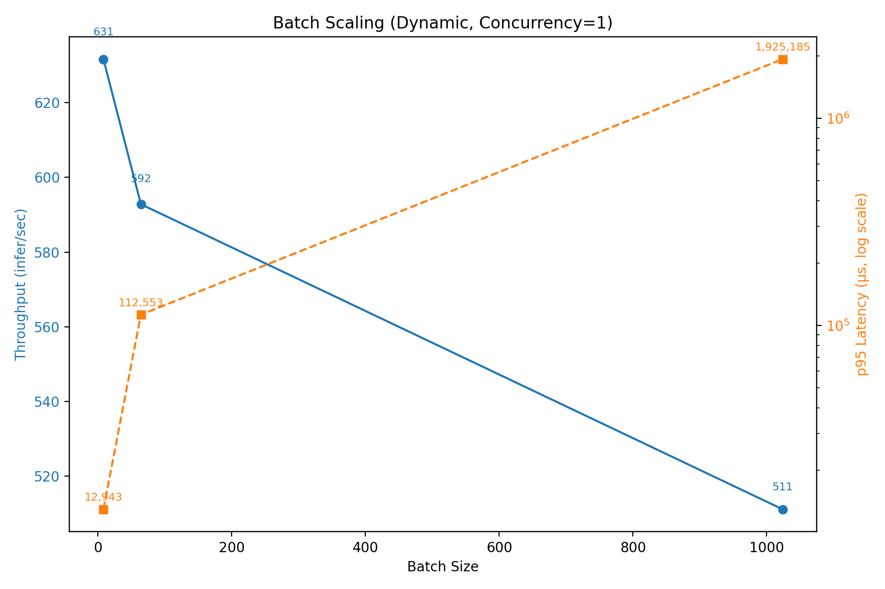
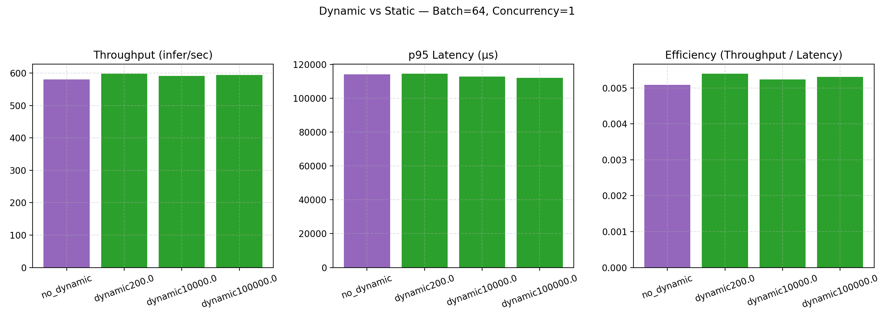
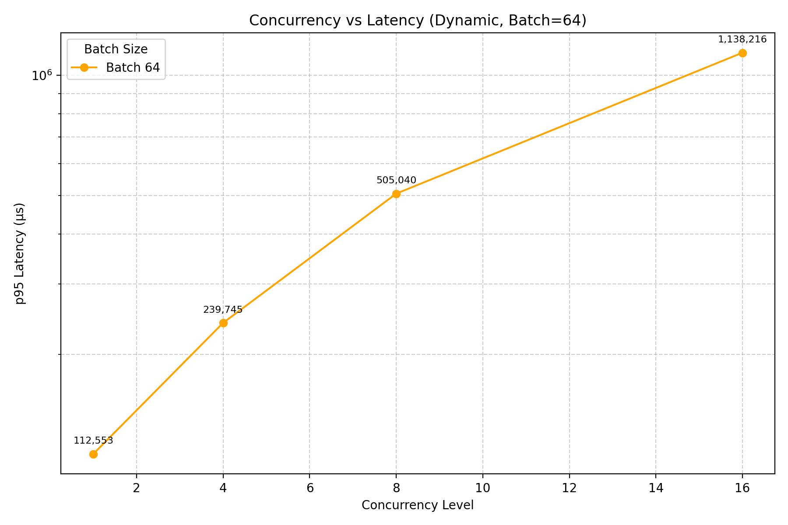
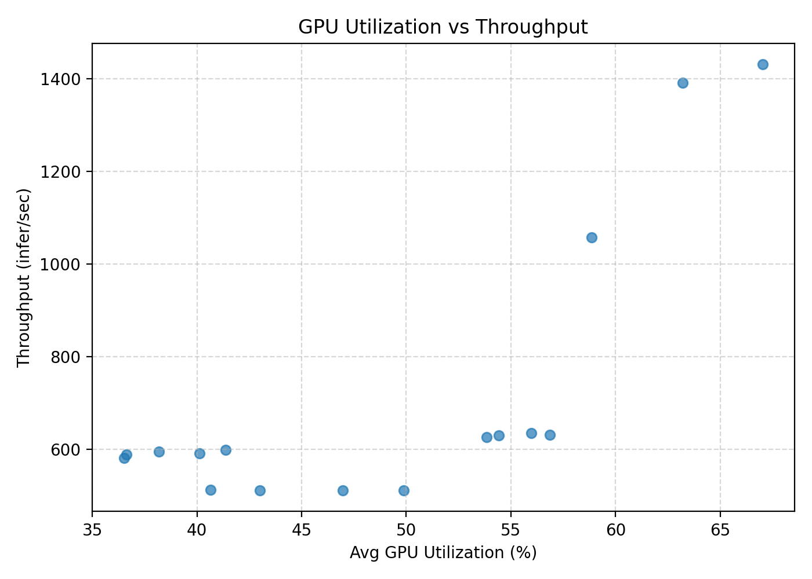

# Performance benchmarking

`perf_analyzer` sweeps against the CLIP vision tower (`clip_visual`) served on
Triton with a TensorRT fp16 engine, varying batch size, client concurrency, and the
dynamic-batching queue delay. `sweep_perf.py` runs the matrix in `config_matrix.json`
(reloading the model config between runs via Triton's HTTP control API);
`analyze_results.py` aggregates the raw perf_analyzer CSVs into `perf_image/`.
Measured on a T4 (16 GB).

## What the sweep showed

- **Concurrency is the throughput lever, not batch size.** Going from 1 to 4
  concurrent clients at batch 64 took throughput from ~598 to ~1431 inf/s (~2.4x) and
  GPU utilization from ~41% to ~67%. Pushing batch size alone (up to 1024) left
  throughput flat around ~511 inf/s while p95 latency blew past a second.
- **Dynamic batching barely moved the needle for this model.** At batch 8 the
  dynamic-batching engine reached ~631 inf/s versus ~625 without it — the vision tower
  is compute-bound enough that queue-delay batching has little left to gather.
- **Large single-request batches are a bad trade.** Batch 1024 plateaus throughput at
  ~511 inf/s and pushes p95 into the millions of microseconds; past the compute-bound
  point, bigger batches only buy latency.

The serving takeaway: scale concurrency before reaching for large static batches or
aggressive queue delays.






## Run it

```bash
tritonserver --model-repository=model_repository --model-control-mode=explicit &
python performance/sweep_perf.py       # matrix → performance/perf_out/ (CSVs), performance/results/ (logs)
python performance/analyze_results.py  # performance/perf_out/ → performance/perf_image/
```
